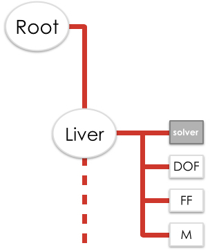
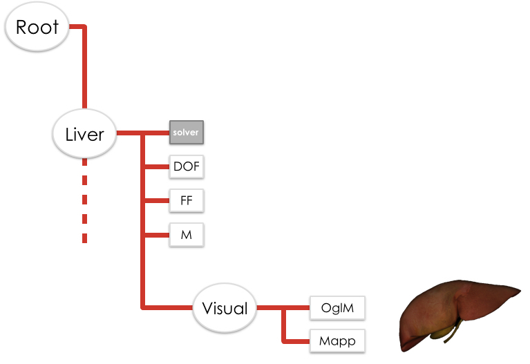
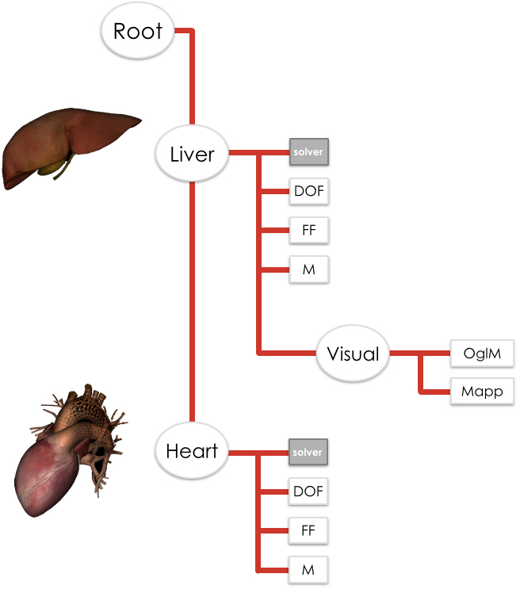

# Scene graph
SOFA 中的模拟被描述为具有内在广义层次结构的场景。 该场景由组织为树或有向无环图 (DAG) 的节点组成。 不同的模拟对象在不同的节点中描述，同一对象的不同表示可以在不同的子节点中完成。



## Structure of a scene
场景从称为“root”节点的父节点开始。 所有其他节点（称为子节点）都继承自该主节点。 在图1中，定义了第一子节点“肝脏”并表示第一对象。 通常，一个节点gather与同一对象相关联的组件（相同的自由度）。

这种设计是高度模块化的，因为场景中的组件彼此独立。 通过更改图中的一个组件，可以简单地将一个物理模型（带有 SpringForceField 的弹簧springs）替换为另一个（带有 TriangleFEMForceField 的三角 FEM）。 同样，通过修改场景文件中的一行 XML，可以将显式集成方案 (EulerSolver) 替换为隐式集成方案 (EulerImplicitSolver)。 框架的这种高度模块化是由下面描述的scenegraph-visitor approach引起的。


如图 2 所示，节点可以在图中按顺序构造。 这种分层图允许具有相同对象的多个表示。 在示例中，第一个子节点“肝脏”实现了肝脏的机械行为（六面体网格），而子节点“视觉”描述了肝脏的表面模型（三角网格）。


图 3 显示了涉及两个不同对象的模拟。 一个节点可以计算肝脏的机械行为，而第二个节点可以模拟心脏的电行为。 这两个系统依赖于两个不同的自由度，即不同的物理现象。 因此，它们必须在两个不同的节点中进行描述。 此功能显示了 SOFA 轻松开发高级耦合模型的能力。

要在 SOFA 中构建模拟，可以使用以下两种方式编写场景图：
 - XML 文件。 阅读有关如何用 XML 编写场景的相关页面。
 - Python 脚本。 阅读有关如何用 Python 编写的相关页面。
 
 ## Data
 图 1 的“肝脏”节点包括用于构建肝脏机械模拟的组件（求解器、力场、质量）。 这些组件中的每一个都包含属性。 例如，质量的一个分量具有质量密度的属性； 迭代线性求解器需要一个定义最大迭代次数的属性。 这些属性也称为数据。 这些数据是提供反射 API 的容器，用于在 XML 文件中序列化和在用户界面中自动创建输入/输出小部件。

两个 Data 实例可以相互连接以保持它们的值同步。 这只有在它们都具有相同类型(``float, vector<double>``)时才有可能。
惰性求值机制用于递归标记不是最新的数据Data。 然后，重新计算数据（仅在必要时）。 互连的数据对象网络定义了数据依赖关系图data dependency graph。 在 XML 文件中，当使用“@”时，一个数据会连接到另一个数据：
````
<Component dataname="@path_to/component.data" />
````

## Tags
任何组件都可以设置一个或多个“标签”。 “标签”数据字段可用于任何 SOFA 组件。 标签可用于在场景中查找特定组件、区分场景图中同一类的多个实例或以不同方式处理这些实例（请参阅下一篇关于 MultiTagAnimationLoop 的文章）。
