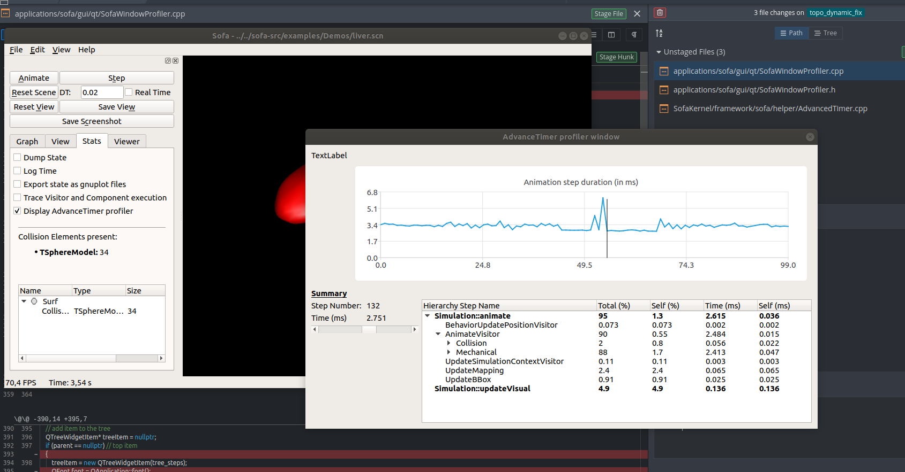
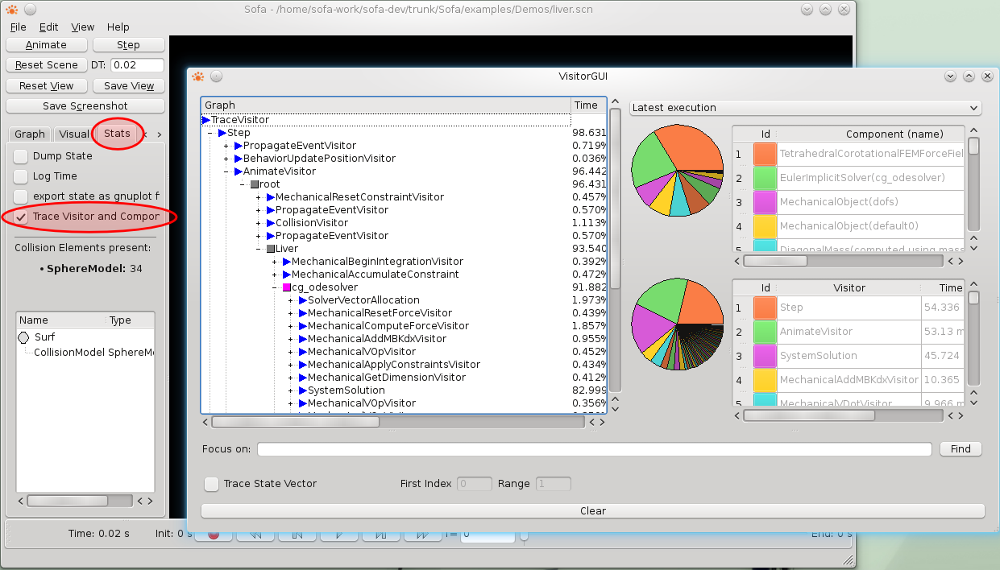
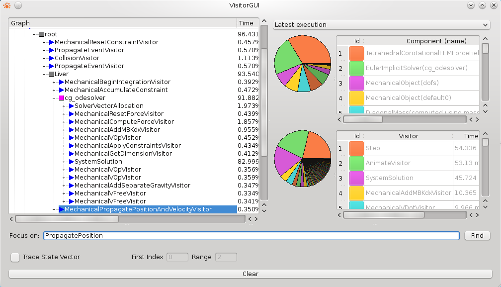
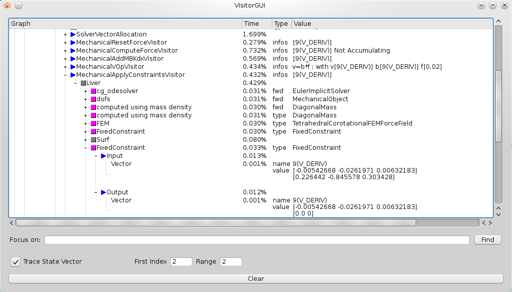

Sofa 提供了两种监控计算时间的方式，一种是文本输出，另一种是图形输出。

### Command-line method: Advanced Timer 
这是在 SOFA 中监控计算时间的最精确和灵活的方式。 它在标准文本输出上打印结果。 这可以在 runSofa 中使用以下命令行选项进行控制（使用 –help 获取完整列表）：
````
--computationTimeSampling arg 
-b [ --computationTimeAtBegin ] [=arg(=1)] (=0)
-o [ --computationTimeOutputType ] arg
````

第一个选项更新变量``computationTimeSampling``，它指定连续统计显示之间的间隔（以动画步长计算）。 0 表示已停用。 其他 2 个可分别用于在 init 期间激活时间统计和更改输出格式。

要监控代码特定部分所花费的时间，请将其括起来，如下所示：

````
sofa::helper::AdvancedTimer::stepBegin("Build linear equation");
 // your code here
sofa::helper::AdvancedTimer::stepEnd("Build linear equation");
````

在一定时间间隔内可以显示相应的计算时间。 开始/结束调用可以嵌套，以分层监控。 
下面显示了一个统计示例。 其中代码段名称前的点数表示嵌套级别：

````
==== Animate ====

Trace of last iteration :
  *    0.06 ms > begin Mechanical on Cube grid
  *    0.10 ms   > begin Build linear equation
  *                > begin forces in the right-hand term
  *    1.27 ms     < end   forces in the right-hand term
  *    1.37 ms     > begin shift and project independent states
  *    1.49 ms     < end   shift and project independent states
  *                > begin local M
  *    2.11 ms     < end   local M
  *    2.38 ms     > begin J products
  *   12.89 ms     < end   J products
  *   12.91 ms     > begin J products
  *   28.06 ms     < end   J products
  *                > begin local K
  *   28.51 ms     < end   local K
  *   28.53 ms     > begin JMJt, JKJt, JCJt
  *   86.86 ms     < end   JMJt, JKJt, JCJt
  *                > begin implicit equation: scaling and sum of matrices, update right-hand term
  *   87.75 ms     < end   implicit equation: scaling and sum of matrices, update right-hand term
  *              < end   Build linear equation
  *              > begin Solve linear equation
  *   90.78 ms   < end   Solve linear equation
  *   94.81 ms < end   Mechanical on Cube grid
  *   94.83 ms > begin UpdateMapping
  *              - step  UpdateMappingEndEvent
  *   94.84 ms < end   UpdateMapping
  *            > begin UpdateBBox
  *   94.93 ms < end   UpdateBBox
  *   94.94 ms END

Steps Duration Statistics (in ms) :
 LEVEL   START    NUM      MIN     MAX   MEAN     DEV    TOTAL  PERCENT ID
   0       0     100      86.57  127.50  109.99    7.77 10999.1  100    TOTAL
   1       0.06    1      86.32  127.25  109.75    7.75  109.75   99.78 .Mechanical
   2       0.09    1      79.42  112.21   99.97    7.02   99.97   90.89 ..Build linear equation
   3       0.09    1       0.84    1.36    1.14    0.14    1.14    1.04 ...forces in the right-hand term
   3       1.34    1       0.07    0.14    0.10    0.02    0.10    0.09 ...shift and project independent states
   3       1.44    1       0.39    0.68    0.55    0.08    0.55    0.50 ...local M
   3       2.23    2       7.52   17.67   12.72    2.34   25.44   23.13 ...J products
   3      27.70    1       0.28    0.54    0.41    0.06    0.41    0.37 ...local K
   3      28.13    1      54.07   79.54   70.61    5.53   70.61   64.20 ...JMJt, JKJt, JCJt
   3      98.75    1       0.88    2.29    1.31    0.24    1.32    1.20 ...implicit equation: scaling and sum of matrices, update right-hand term
   2     100.06    1       2.71    4.79    3.75    0.51    3.75    3.41 ..Solve linear equation
   1     109.84    1       0.01    0.02    0.02    0       0.02    0.01 .UpdateMapping
   2     109.84    1       0       0       0       0       0       0    ..UpdateMappingEndEvent
   1     109.85    1       0.09    0.28    0.14    0.03    0.14    0.12 .UpdateBBox

==== END ====
````
在该表的第一行，给出了 100 次模拟迭代的平均值。 只有第一行的 TOTAL 值是在这 100 次迭代中经过的总时间（以毫秒为单位）。 表格的其余部分是一个模拟步骤中每个计算步骤的平均值。 NUM 是每个模拟步骤完成操作的次数。 可以注意到，“Mechanical”和“UpdateBBox”是模拟步骤的2个主要操作，百分比之和为100% 。

### Graphical Interface: Profiler

添加了一个图形工具，以便从基于 AdvanceTimer 记录的分析窗口获取有用的信息。 通过在 runSofa 的“Stats”小部件中勾选“Display AdvancedTimer Profiler”框来激活该分析器。

此选项允许在 graphView 中查看动画步骤持续时间 (ms)，然后允许在图表或滑块上导航并分析在此动画步骤期间执行的不同子步骤。 子步骤以正确的顺序显示在Tree中，并带有各自的时间和百分比（关于完整的步骤持续时间）。 该工具的设计灵感来自 Unity3D profiler。



各列的说明：

1. Total (%)：此步骤的持续时间与根步骤的持续时间相比的百分比。
2. Self （％）：
 - 如果步骤有子步骤：与根步骤的持续时间相比，此步骤的持续时间减去其子步骤的持续时间总和的百分比。
 - 如果步骤没有子步骤：在此时间步骤中多次调用此步骤的情况下，此步骤的平均持续时间与根步骤的持续时间相比的百分比。
3. Time（毫秒）：此步骤的持续时间（以毫秒为单位）。
4. Self（毫秒）：
 - 如果步骤有子步骤：此步骤的持续时间（以毫秒为单位）减去其子步骤的持续时间总和。
 - 如果步骤没有子步骤：在此时间步骤中多次调用此步骤的情况下，此步骤的平均持续时间（以毫秒为单位）。

### Graphical Interface: Trace Visitor
存在使用 Qt 的图形工具，并集成在 SOFA 主应用程序中，以跟踪和分析SOFA中Visitor的执行情况。 它正在进行中，并且不如以前的方法准确。 它可以用在插图中说明如何使用Visitor在图中的轨迹。

#### How to enable the trace of the visitors
需要在SOFA配置中激活选项 SOFA_DUMP_VISITOR_INFO。 它应该默认启用。 如果没有，可以使用 **SofaVerification** 来修改 SOFA 的配置。



#### Quickly find information
要查找特定访问者或对组件的调用，可以使用搜索栏：


#### View State vectors
另一个有趣的功能是可以跟踪状态向量的演变：只需启用该选项，并指定粒子数量； -1 表示所有粒子。

在这里，我们跟踪 2 号和 3 号粒子。一个 FixedConstraint 在这个场景中作用于粒子 3：它过滤其速度和加速度，并将其设置为零，以充当固定粒子。 我们可以可视化 ApplyConstraint 访问者对状态向量的影响。

#### Add new debug information
 - Trace specific part of the code 跟踪特定代码块
要跟踪和分析程序的一部分的执行，请在要分析的代码的开头放置：
````
simulation::Visitor::printNode("NameMethod");
````
最后close这个过程
````
simulation::Visitor::printCloseNode("NameMethod");
````
方法 printNode 可以采用其他参数来获取更详细的日志
````
sofa::simulation::Visitor::TRACE_ARGUMENT arg;
arg.push_back(std::make_pair("ArgumentName", "Value"));
sofa::simulation::Visitor::printNode("MyDebug", arg);
//....
sofa::simulation::Visitor::printCloseNode("MyDebug");
````
 - Trace an additional state vector 跟踪额外的状态向量
在您的代码中，您可以随时监视给定机械状态(mechanical state)写入的状态向量：
````
if (sofa::simulation::Visitor::IsExportStateVectorEnabled())
{
   sofa::simulation::Visitor::printNode("MyDebug");
   sofa::simulation::Visitor::printVector(mstate, id); //mstate is a ptr to a mechanical state, id is a VecId, indicating the state vector
   sofa::simulation::Visitor::printCloseNode("MyDebug");
}
````
